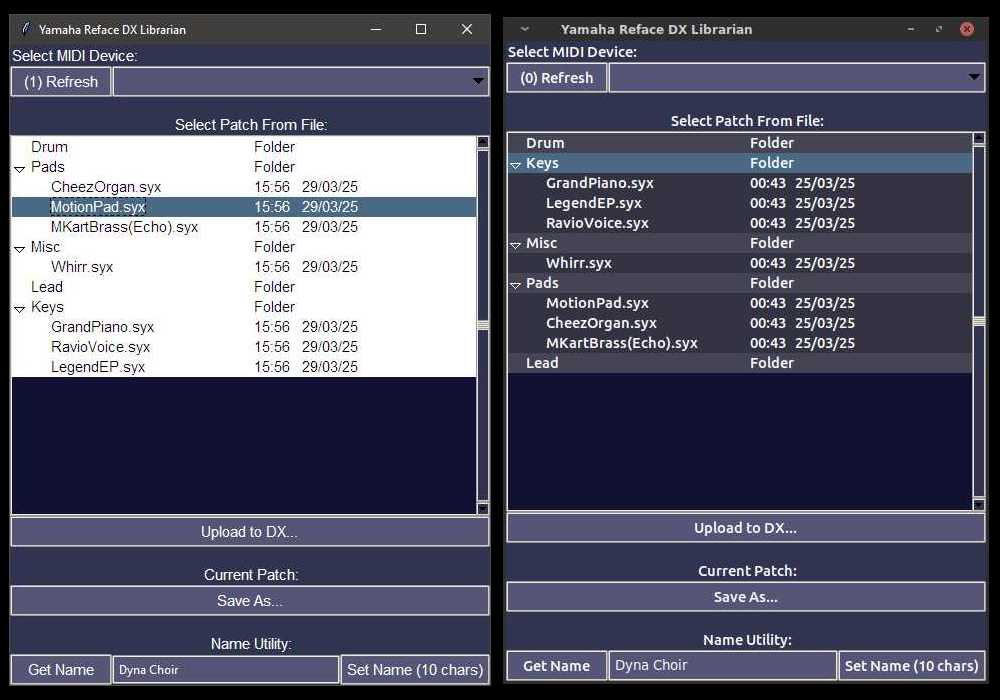

# DX Librarian
- Single-window Linux-based Python+TTK Yamaha Reface DX Synthesizer Patch Librarian
- Just run dxlibrarian.py in the current directory, access the midi device and 
- Uses the great Mido library (https://github.com/mido/mido) for all of the communication via MIDI.
- Primarily designed for linux

*This project is not likely to be maintained unless Yamaha release firmware updates for the Reface DX*

## Features:
  - Portable Single window interface built around ttk.
  - Easy patch name editing via main window.
  - Lists folders and files one level down in the running directory (non-recursive)

